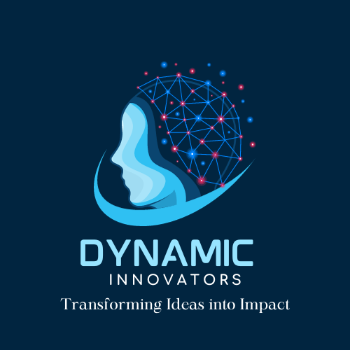

# Dynamic Innovators Portfolio 

Welcome to the Dynamic Innovators Portfolio repository! This website showcases our agency's work and is designed to be fully responsive, providing an optimal viewing experience across various devices.

## Link To Project Demo ](https://dynamic-innovators-portfolio.vercel.app/)

## Technology Used 

The Dynamic Innovators Portfolio is built using a modern technology stack to ensure a seamless and engaging user experience.

1. **HTML 5** : The foundation of the web, providing the structure for our pages.
2. **CSS 3** : Styling to enhance the visual appeal and layout of the website.
3. **JavaScript (vanilla)** : Adding dynamic and interactive elements to the site.
4. **jQuery** : A fast and feature-rich JavaScript library for simplifying tasks like DOM manipulation and event handling.
5. **Bootstrap** : A popular front-end framework for developing responsive and mobile-first projects.
6. **MixItUp Plugin** : Used for smooth and animated filtering and sorting of portfolio items.

## Features 

- Fully responsive design for optimal viewing on all devices.
- Interactive and dynamic elements to engage users.
- Utilization of Bootstrap for a consistent and modern UI.
- MixItUp plugin for dynamic filtering and sorting of portfolio items.

## Getting Started 

To explore our portfolio, simply open the `index.html` file in your preferred web browser. If you plan to contribute or make modifications, ensure you have the necessary tools and dependencies installed.

## Support Us 

If you find our work valuable, consider supporting us by  

## Contact Information 

- **GitHub**:
  - 
  - 
- **Email**: <flowifyhack@gmail.com> 

Feel free to reach out if you have any questions or feedback!

Happy exploring!
